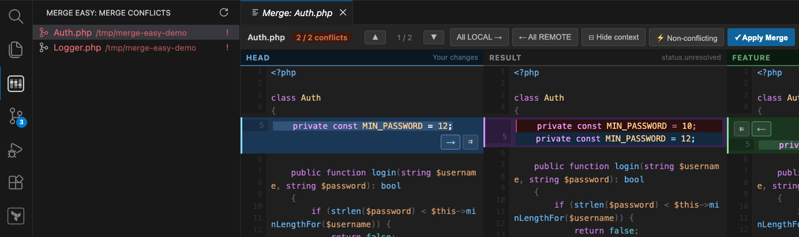
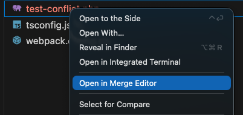
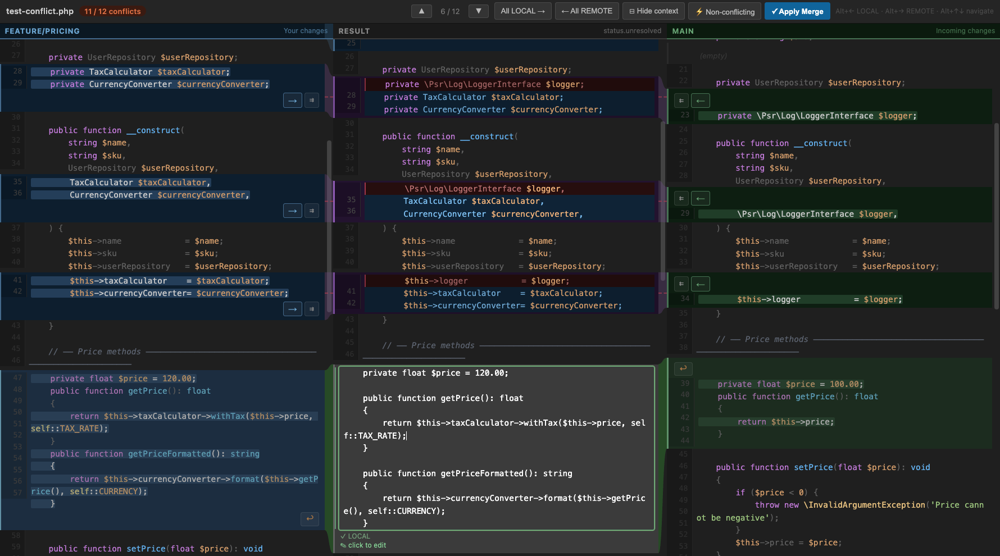
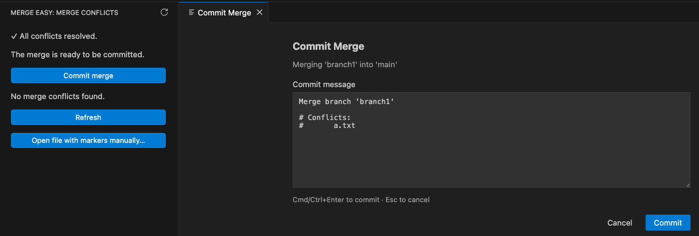

# Merge Easy

A side-by-side merge conflict editor for VS Code – three panels side by side (LOCAL · RESULT · REMOTE) with live word-level diff highlighting and bezier ribbon connectors between matching blocks. Plus an activity-bar sidebar that surfaces every conflicting file in the workspace.

## Features

- **Conflicts sidebar** – activity-bar view that lists every unmerged file in the workspace; click an entry to jump straight into the merge editor
- **3-panel layout** – LOCAL (your changes) | RESULT (live editable center) | REMOTE (incoming)
- **Word-level diff** – changed tokens are highlighted with a brighter background in all three panels so you instantly see what exactly changed
- **SVG ribbon connectors** – bezier ribbons visually connect matching conflict blocks across panels (blue for LOCAL-only, green for REMOTE-only, red for true conflicts)
- **Non-conflicting auto-detection** – blocks where only one side changed are shown in blue/green without a conflict badge and can be accepted in bulk with one click
- **Bulk accept** – `All LOCAL →` and `← All REMOTE` toolbar buttons resolve every remaining hunk in one click, with an `↩ Undo bulk` button to revert
- **Commit-merge dialog** – when every conflict is resolved, the sidebar offers a one-click "Commit merge" with branch-name confirmation and an optional message-edit dialog
- **Syntax highlighting** – context sections use highlight.js (PHP, JS/TS, Python, Java, Go, CSS, HTML, JSON, SQL, Bash, YAML, …)
- **Editable RESULT panel** – click any resolved block to edit the merged text directly
- **Navigate conflicts** – toolbar buttons or `Alt+↑` / `Alt+↓`
- **Keyboard shortcuts** – `Alt+→` accept LOCAL, `Alt+←` accept REMOTE
- **Apply & git add** – one click saves the resolved file and runs `git add` automatically
- **diff3 support** – detects three-way conflict markers including the common ancestor (BASE)

### Conflicts sidebar



### Open with context menu



### Merge editor



### Commit the merge



## Usage

1. Open a workspace that has unresolved merge conflicts.
2. Click the **Merge Easy icon** in the activity bar to see the list of conflicting files, or right-click a file in the Explorer → **Open in Merge Editor**.
3. Resolve conflicts by clicking the arrow buttons (`→` / `←`) or pressing `Alt+→` / `Alt+←`.
4. Optionally click **⚡ Non-conflicting** to auto-accept all unambiguous hunks, or use **All LOCAL →** / **← All REMOTE** to bulk-accept the rest of one side. **↩ Undo bulk** reverts the last bulk action.
5. Click **✓ Apply Merge** to save and stage the file.
6. When every conflict is resolved, the sidebar shows **Commit merge** – click it to confirm and finish the merge in one step.

## Keyboard shortcuts

| Shortcut | Action |
|---|---|
| `Alt+↑` | Previous conflict |
| `Alt+↓` | Next conflict |
| `Alt+→` | Accept LOCAL for active conflict |
| `Alt+←` | Accept REMOTE for active conflict |

## Optional: enable diff3 style

By default git shows only two sides. To also see the common ancestor (BASE) in conflict markers:

```bash
git config --global merge.conflictstyle diff3
```

## Color legend

| Color | Meaning |
|---|---|
| Blue (`#43698D`) | LOCAL changes (your branch) |
| Green (`#447152`) | REMOTE changes (incoming branch) |
| Red (`#8F5247`) | True conflict – both sides changed the same lines |
| Brighter highlight within a line | Word-level change within that line |

